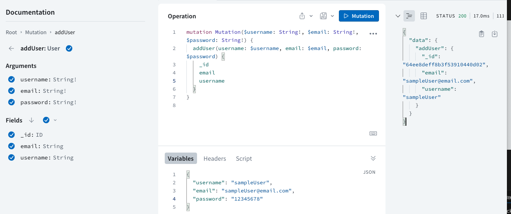
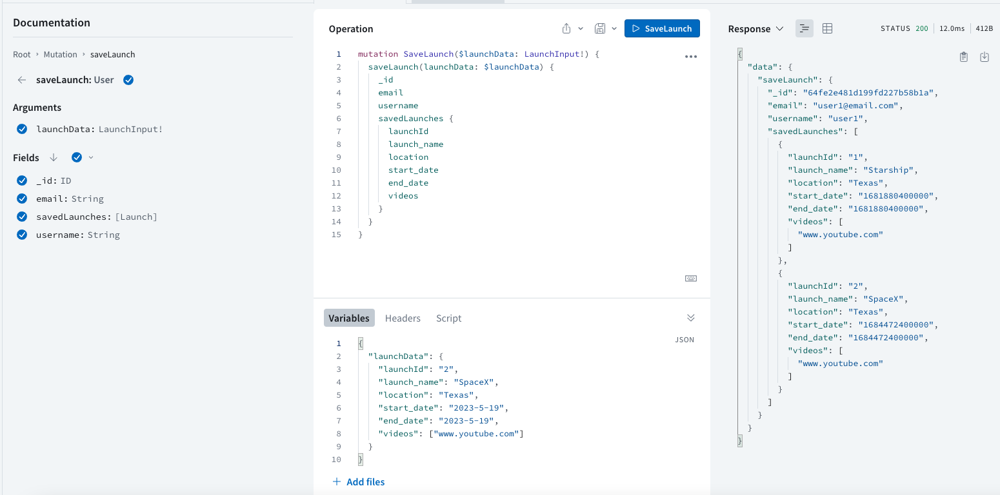
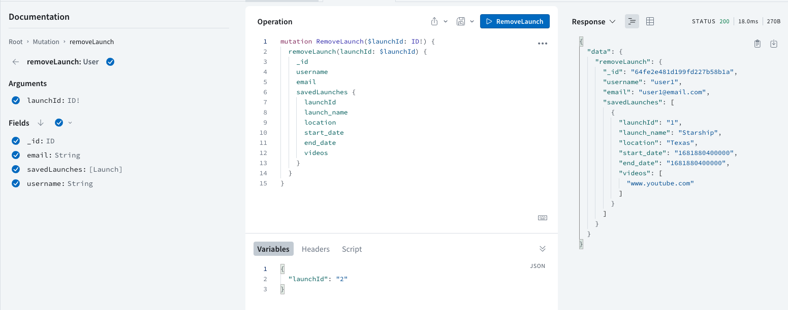
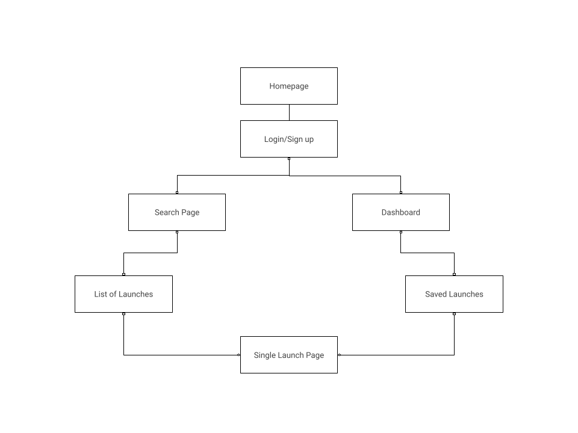
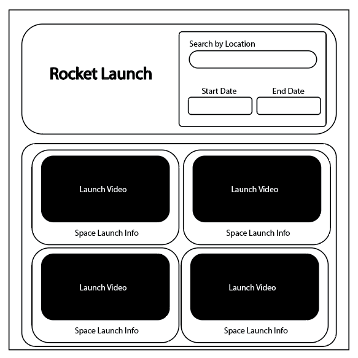

# RocketLaunch

## Description
RocketLaunch is a full stack application created with MongoDB, Express, React, Node, and GraphQL that can be utilized to search for and watch rocket launches.

## Video Demonstration
Click on the image to view video  
<a href="https://www.youtube.com/watch?v=9kTWk4kgLog" target='_blank'></a>

## Table of Contents
* [Installation](#installation)
* [Usage](#usage)
* [Apollo/GraphQL](#apollographql)
* [Wireframe](#wireframe)

## Installation
1. Copy the clone link of the repository from GitHub.
2. Open Bash or Terminal Window.
3. When the console opens, navigate to the directory the repository will be added to. *Remember to use the command cd to change directories.*
4. In the console, type the command <i> git clone </i> and paste the link to repository.
5. Open repository in preferred code editor.
6. Open terminal in code editor.
7. Type in terminal <i>npm i</i> or <i>npm install </i> to install dependency packages needed.
8. Once all dependencies have been installed, run <i>npm run develop</i> to run the front and back end of the application.

[⬆ Back to top](#table-of-contents)

## Usage
- Click on the Login/Signup button to gain access to the site. 
- Once logged in, the dashboard page will be presented. This is where the saved launches will be stored for later view. 
- Click on the search on the navigation bar to direct to the search page where launches can be searched. 
- Once the search criteria has been entered, the results will populate. Click on the save button to save launch to dashboard page.

[⬆ Back to top](#table-of-contents)

## Apollo/GraphQL

[⬆ Back to top](#table-of-contents)

## WireFrame

[⬆ Back to top](#table-of-contents)